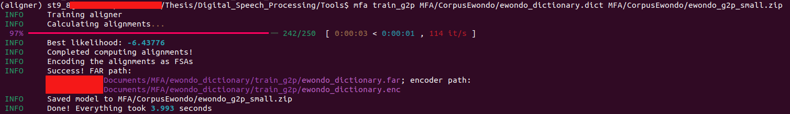
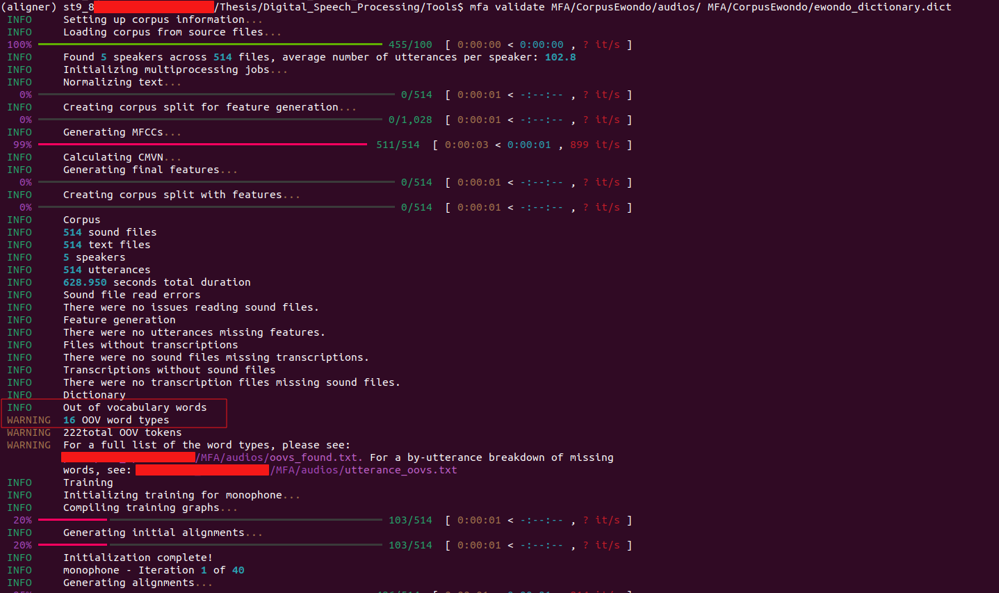
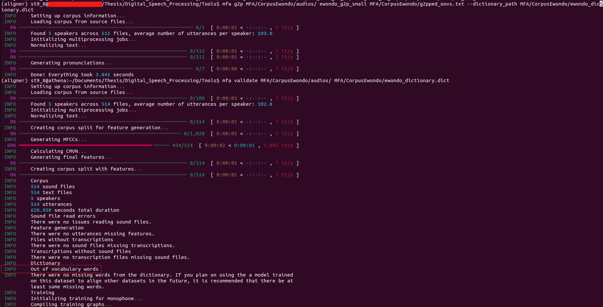
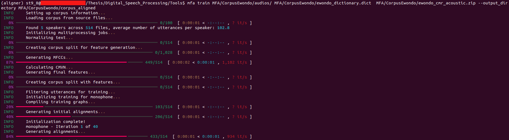
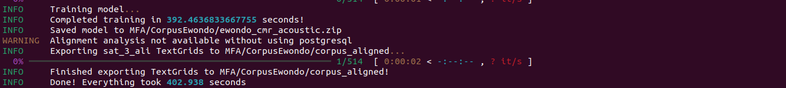
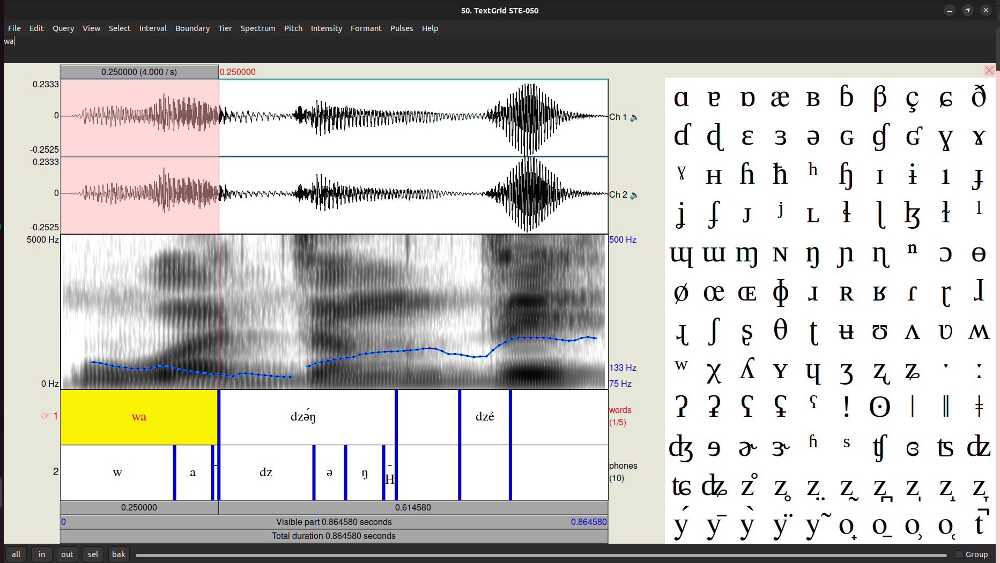
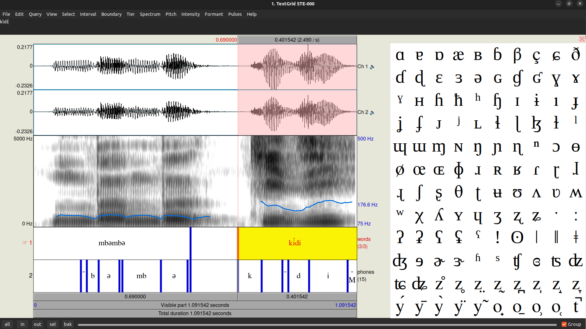

# Performing Forced Alignment on Ewondo using Montreal Forced Aligner

In this document, we shall present how we used Montreal Forced Aligner to perform forced alignment on a low-resource
language, **Ewondo** from Cameroon.

## Montreal Forced Aligner (MFA)

MFA is a fantastic tool that enables the task of forced alignment using Kaldi as a backend, as well as the HMM-GMM
architecture. This is a task that consists of taking an orthographic transcription of an audio file and generating a
time-aligned version using a **pronunciation dictionary**. Several languages now
have [pre-trained acoustic models](https://mfa-models.readthedocs.io/en/latest/acoustic/index.html) available in MFA,
but unfortunately for languages such as ours, the work remains to be done. You will find more information in
the [User Guide](https://montreal-forced-aligner.readthedocs.io/en/latest/user_guide/index.html) or in
the [paper](https://montrealcorpustools.github.io/Montreal-Forced-Aligner/images/MFA_paper_Interspeech2017.pdf).

## Introduction

In the [documentation](https://montreal-forced-aligner.readthedocs.io/en/latest/first_steps/index.html#first-steps) for
MFA, we can see that there are 6 use cases in which this tool can be employed. If your language is listed in
the [MFA acoustic models](https://mfa-models.readthedocs.io/en/latest/acoustic/index.html), in
the [MFA dictionaries](https://mfa-models.readthedocs.io/en/latest/dictionary/index.html), and in
the [G2P models](https://mfa-models.readthedocs.io/en/latest/g2p/index.html), your life will be very easy; you can
simply follow steps 1 or 2. However, if your language is not listed anywhere, it will be more complicated for you. We
recently used this tool for the **Ewondo** language, which is not listed anywhere, and in this case we are interested in
option 5.

That is to say:

1. We have our audio corpus
2. We have a dictionary that does not adequately cover all the words in the corpus.

In what follows, we shall detail each of the steps we used to accomplish our task.

## Generating our Vocabulary

The reality is that we do not have a vocabulary for our corpus; this is a prerequisite for obtaining a pronunciation
dictionary (lexicon), so we wrote a script (`extract_vocabulary.py`) that compiled this vocabulary from the available
transcriptions.
Our [corpus](https://montreal-forced-aligner.readthedocs.io/en/latest/user_guide/corpus_structure.html#corpus-structure)
is structured as follows:

### Corpus

- 103 pairs of simple sentences: consisting of 1 to 10 words
- 5 speakers:
    - 4 men: aged 25 to 27 years, amongst whom 3 are native speakers
    - 1 woman: native speaker
- Audio files with a duration of at most 3s
- Simple transcriptions available
- Aligned transcriptions unavailable
- Lexicon unavailable

We obtained a vocabulary of 208 distinct words

```
> Fám
> abán
> abǒg
> abuí
> abum
> afan
> ...
```

## Generating the Dictionary (Lexicon)

Once the vocabulary was obtained, we could proceed to the lexicon generation stage. The lexicon or pronunciation
dictionary is a document that, for each word in the dictionary (ideally), contains its phonemic transcription. To
accomplish this task, we used a [tool](https://github.com/germes96/ETTA) written by a laboratory colleague; it serves as
a foundation and is used in a script (`generate_lexicon.py`) that extracts words from the vocabulary and generates a
lexicon. We therefore obtained a lexicon for each word in the vocabulary in one of
the [formats](https://montreal-forced-aligner.readthedocs.io/en/latest/user_guide/dictionary.html#dictionary-format)
supported by MFA.

```
> fám f a m -H
> abán a -M b a n -H
> abǒg a -M b o g -BH
> abuí a -M b u -M i -H
> abum a -M b u m -M
> afan a -M f a n -M
> ...
```

## Training a G2P Model

**G2P** stands for **Grapheme-to-Phoneme**; this is a task that generates the associated phonemic transcription for a
word. We decided to train a G2P model for Ewondo with our dictionary and our corpus in order to have a tool capable of
generating dictionaries when necessary.

At this stage, we assume that you have installed MFA by following
the [guide](https://montreal-forced-aligner.readthedocs.io/en/latest/installation.html#installation) and that it is
available on your PC.

```
(aligner)> mfa train_g2p ~/mfa_data/dictionary.txt ~/mfa_data/ewondo_g2p_ipa_small.zip
```

This command trains a G2P model using the `dictionary.txt` dictionary and saves it in `ewondo_g2p_ipa_small`.



## Training an Acoustic Model

This is the model that will enable us to perform alignment. Now that we have the dictionary and the corpus, we can
proceed with its training. However, before that, we must carry out a validation stage that ensures all the data are
correct and ready for training.

```
(aligner)> mfa validate ~/mfa_data/corpus_ewondo ~/mfa_data/dictionary.txt
```



We can see that the validation indicates that we have **16 OOV words**, which simply means that we have 16
Out-Of-Vocabulary words, that is to say, words that are present in the corpus but not in the dictionary. This is only a
*Warning* because MFA is capable of proceeding with alignment even with the presence of OOVs, which is not the case for
other forced alignment tools. To remedy this, we can use our trained G2P model to generate a dictionary that covers the
entire corpus.

```
(aligner)> mfa g2p ~/mfa_data/corpus ewondo_g2p_ipa_small ~/mfa_data/g2pped_oovs.txt --dictionary_path ~/mfa_data/dictionary.txt
```

This command will update our dictionary, and it will store the transcriptions of the OOVs in `g2pped_oovs.txt`.


Once completed, we now have a complete dictionary, and it possesses transition probabilities in addition to the
transcriptions. This format is described in the
*[Silence probabilities](https://montreal-forced-aligner.readthedocs.io/en/latest/user_guide/dictionary.html#dictionary-format)*
section of the MFA User Guide.

```
> fám 0.99 0.21 1.6 0.87 f a m -H
> abán 0.99 0.79 1.59 0.68 a -M b a n -H
> abǒg 0.99 0.51 1.05 0.96 a -M b o g -BH
> abuí 0.99 0.65 0.97 1.02 a -M b u -M i -H
> abum 0.99 0.79 0.95 1.03 a -M b u m -M
> afan 0.99 0.79 1.05 0.96 a -M f a n -M
```

Now that we have a complete dictionary, let us perform the validation once more before training the acoustic model.



We no longer have any *Warnings*; we can proceed with training!

```
(aligner)> mfa train ~/mfa_data/corpus ~/mfa_data/dictionary.txt ~/mfa_data/ewondo_cmr_acoustic.zip --output_directory ~/mfa_data/corpus_aligned
```

This command will train an acoustic model using the corpus and the dictionary, and store it in `ewondo_cmr_acoustic`.
The aligned corpus will be stored in the `corpus_aligned/` folder.


...


Our model is trained and can now be reused! Congratulations.

## Visualising the Alignments

Now that our acoustic model is ready, we can use it to align other Ewondo corpora. MFA directly aligns the corpus used
with the newly trained model, and the alignment format
is [TextGrid](https://montreal-forced-aligner.readthedocs.io/en/latest/user_guide/corpus_structure.html#textgrid-format).
We can therefore visualise the aligned data directly in the [Praat](https://www.fon.hum.uva.nl/praat/) tool.

You can see some alignments performed by our model below:





## Conclusion

In this tutorial, our aim was to demonstrate how forced alignment on a low-resource language can be performed using
Montreal Forced Aligner, which represents the state of the art in forced alignment models. We chose the **Ewondo**
language, originating from the centre of Cameroon, and built an acoustic model capable of aligning it. All the files and
scripts are open, free. An exclusive article on the evaluation of forced alignment will also be proposed subsequently.
Finally, we shall carry out this work with other forced alignment tools,
notably [Prosodylab Aligner](https://github.com/prosodylab/Prosodylab-Aligner), [CLAP-IPA](https://github.com/lingjzhu/clap-ipa),
and [MMS](https://ai.meta.com/blog/multilingual-model-speech-recognition/).

Written by: [Stephane Fedim](https://github.com/st9-8)